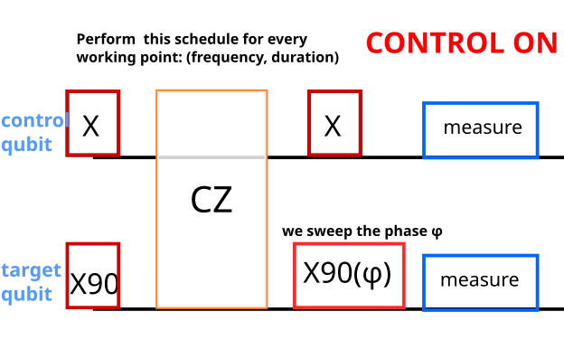
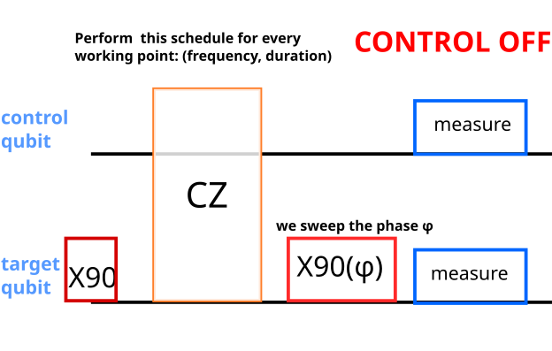
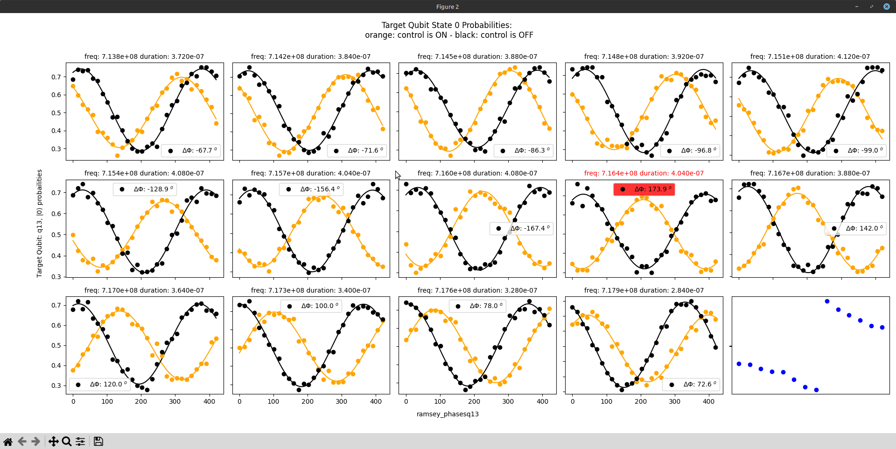
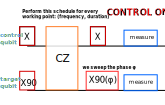
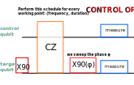

For each working point: (frequency, duration) we perform a cz calibration phase sweep.

The sweep is done first with the Control qubit ON (an X gate is applied on the control qubit),
producing a sinusoidal oscillation of the state 0 probability in terms of the ramsey phases.

The sweep is repeated with the Control qubit OFF,
producing a shifted sinusoidal oscillation of the state 0 probability in terms of the ramsey phases.

The (frequency, duration) working point where the phase shift is closest to $180^o$ is kept as the Quantity of Interest values.

A derivation of the phase shift follows:

Definitions:

$X\left|0\right\rangle =\left|1\right\rangle$

$X90\left|0\right\rangle = \frac{1}{\sqrt{2}}\left(\left|0\right\rangle -\imath\left|1\right\rangle \right)$

$X90\left|1\right\rangle = \frac{1}{\sqrt{2}}\left(-\imath\left|0\right\rangle +\left|1\right\rangle \right)$

$X90_{\phi}\left|0\right\rangle = \left|0\right\rangle -\imath e^{\imath\phi}\left|1\right\rangle$

$X90_{\phi}\left|1\right\rangle = -\imath e^{-\imath\phi}\left|0\right\rangle +\left|1\right\rangle$

The Control Phase gate acts as:

$CPh\left|0\right\rangle \left|0\right\rangle =\left|0\right\rangle \left|0\right\rangle$

$CPh\left|0\right\rangle \left|1\right\rangle =\left|0\right\rangle \left|1\right\rangle$

$CPh\left|1\right\rangle \left|0\right\rangle =\left|1\right\rangle \left|0\right\rangle$

$CPh\left|1\right\rangle \left|1\right\rangle =e^{\imath\delta}\left|1\right\rangle \left|1\right\rangle$

{height=400}

## **Control ON**

**First operation apply X on control and X90 on target:**

\begin{align*}
X\left|0\right\rangle X90\left|0\right\rangle  & =\frac{1}{\sqrt{2}}\left|1\right\rangle \left(\left|0\right\rangle -\imath\left|1\right\rangle \right)\\
 & =\left|1\right\rangle \left|0\right\rangle -\imath\left|1\right\rangle \left|1\right\rangle 
\end{align*}

**Second operation apply the Controled Phase:**

$$CPh\left(\left|1\right\rangle \left|0\right\rangle -\imath\left|1\right\rangle \left|1\right\rangle \right)=\left(\left|1\right\rangle \left|0\right\rangle -\imath e^{\imath\delta}\left|1\right\rangle \left|1\right\rangle \right)$$

**Third operation apply X on control and sweep ramsey phase on target:**

\begin{align*}
X^{c}X90_{\phi}^{t}\left(\left|1\right\rangle \left|0\right\rangle -\imath e^{\imath\delta}\left|1\right\rangle \left|1\right\rangle \right) & =X\left|1\right\rangle X90_{\phi}\left|0\right\rangle -\imath e^{\imath\delta} X\left|1\right\rangle X90_{\phi}\left|1\right\rangle \\
& =\left(1-e^{\imath\delta-\imath\phi}\right)\left|0\right\rangle \left|0\right\rangle -\imath e^{\imath\delta}\left(1+e^{\imath\phi-\imath\delta}\right)\left|0\right\rangle \left|1\right\rangle
\end{align*}

The probability of the target being at the \left|1\right\rangle is the squared amplitude of the second term:

\begin{align*}
p_{target:1} & =\left(1+e^{\imath\left(\delta-\phi\right)}\right)\left(1+e^{-\imath\left(\delta-\phi\right)}\right)=2+e^{\imath\left(\delta-\phi\right)}+e^{-\imath\left(\delta-\phi\right)}\\
 & =1/2+e^{\imath\left(\delta-\phi\right)}-e^{-\imath\left(\delta-\phi\right)}=\boxed{1/2(1+\cos\left(\delta-\phi\right))}
\end{align*}

{height=400}

## **Control OFF**

\begin{align*}
\left|0\right\rangle X90\left|0\right\rangle  & =\frac{1}{\sqrt{2}}\left|0\right\rangle \left(\left|0\right\rangle -\imath\left|1\right\rangle \right)\\
 & =\left|0\right\rangle \left|0\right\rangle -\imath\left|0\right\rangle \left|1\right\rangle 
\end{align*}

$$CPh\left(\left|0\right\rangle \left|0\right\rangle -\imath\left|0\right\rangle \left|1\right\rangle \right)=\left|0\right\rangle \left|0\right\rangle -\imath\left|0\right\rangle \left|1\right\rangle$$

\begin{align*}
X90_{\phi}^{t}\left(\left|0\right\rangle \left|0\right\rangle -\imath\left|0\right\rangle \left|1\right\rangle \right) & =\left(\left|0\right\rangle X90_{\phi}\left|0\right\rangle -\imath\left|0\right\rangle X90_{\phi}\left|1\right\rangle \right)\\
 & =\left[\left(1-e^{-\imath\phi}\right)\left|0\right\rangle \left|0\right\rangle -\imath\left(1+e^{\imath\phi}\right)\left|0\right\rangle \left|1\right\rangle \right]
\end{align*}

\begin{align*}
p_{target:1} & =1/2\left(1+e^{-\imath\phi}\right)\left(1+e^{+\imath\phi}\right)\\
 & =1/2+e^{-\imath\phi}+e^{+\imath\phi}=1/2+\cos{\left(\phi\right)}\\
 & =\boxed{1/2(1+\cos{\left(\phi\right))}}
\end{align*}

Complaring the expressions of the sinusoidal oscillations in terms of the Ramsey phase $\phi$,
they differ by the phase $\delta$ caused by the Control Phase gate.
If this $\delta$ is equal to $180^{\circ}$ this operation implements a CZ gate.
