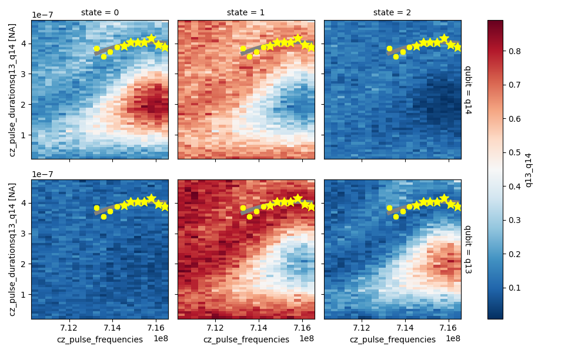

The Cz Chevron node sweeps the frequency and the duration of the AC flux pulse.
The amplitude of the flux pulse as well as the bias DC current are at fixed values determined by the
previous node (cz_parametrization)

The measurement is done with 3 state readout while the three state discriminator had already been found from the `ro_ampl_three_state_optimization` node.

This measurement displays that for the particular bias current $(460\mu A)$ , a parameter region is observed, where population transfer is mediated by the coupler:
<figure markdown>
{ title="the (frequency-duration) pairs that mediate a full return
    to the $\left(|11\rangle$ state" alt="cz chevron working points" }
<figcaption>Working points determined from the cz chevron graph.</figcaption>
</figure>
