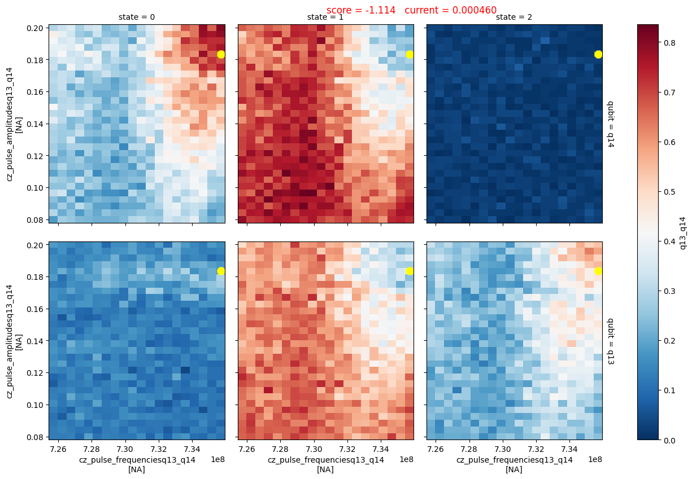
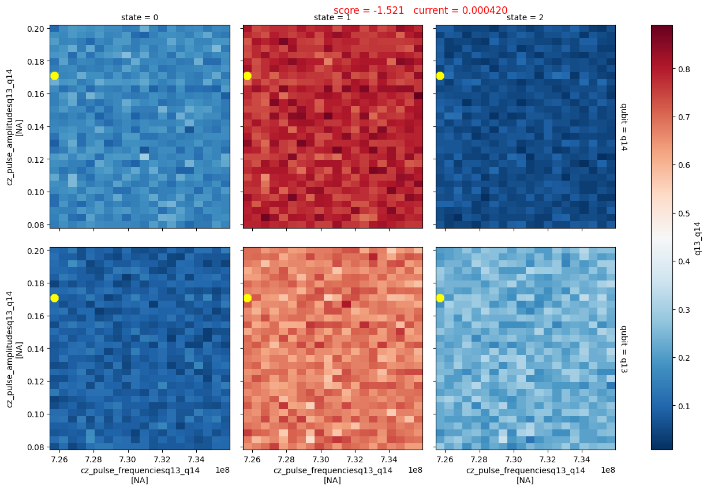

Cz parametrization sweeps the frequency and amplitude of the AC flux pulse as well as the DC current that biases the coupler.

- The frequency sweep is done around the $\left(f_{|11\rangle} - f_{|02\rangle}\right)$ or the $\left(f_{|11\rangle} - f_{|20\rangle}\right)$ frequency difference.

- The amplitude sweep is done around empirically chosen values.

- The DC current sweep is done around at regions where the coupling anticrossing is expected to mediate population transfer between the two qubits.

The measurement is done with 3 state readout while the three state discriminator had already been found from the `ro_ampl_three_state_optimization` node.

This measurement displays that for the particular bias current $(460\mu A)$ , a parameter region is observed, where population transfer is mediated by the coupler:
<figure markdown>
{ title="population transfer mediated by coupler" alt="cz active parametrization" }
<figcaption>population transfer observed</figcaption>
</figure>

While this measurement shows that for an other DC current value $(420\mu A)$ the qubits remain at the $|11\rangle$ state throughout the sweep:
<figure markdown>
{ title="qubits remain at |11>" alt="cz inactive parametrization" }
<figcaption>qubits remain at |11> throughout the parameter sweep</figcaption>
</figure>
