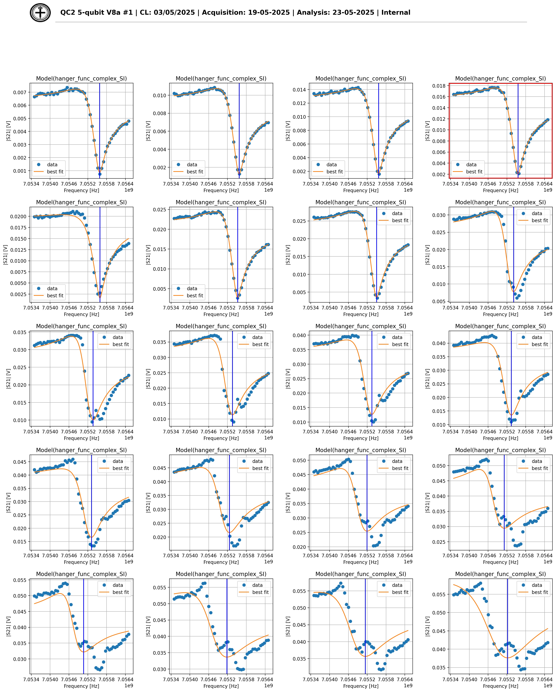

## Resonator spectroscopy as a function of the readout amplitude (aka Punchout)

The resonator spectroscopy measured as a function of the readout amplitude can be used to extract the optimal readout amplitude. This is possible as the response of the resonator should be constant until too much energy is sent to it. Looking at the changes in the resonator frequency, it is possible to estimate the last stable point and set the readout amplitude.   

## Physical motivation for punchout node

The qubit and the resonator are coupled. This is one of the fundamentals for the way, the qubit is read out.
Being coupled means that when the resonator starts to oscillate, the qubit will do so, as well.
Now, by design, we do not want the resonator to affect the qubit too much.
Otherwise, the readout would affect the qubit state and that would be bad.
This is why when the readout resonator begins to oscillate too much, it will not couple to the qubit anymore.
Now in the punchout, the idea is to drive the resonator up to the point until it does not couple to the qubit any longer.
As long as it is coupled to the qubit, the frequency is slightly higher.
This frequency is called the **dressed frequency**.
By adding energy in form of increasing the amplitude, eventually, the resonator no longe couples significantly to the qubit.
In the plot, one can see that the frequency will go down a bit.
The new frequency of the resonator is now called the **bare frequency**.

## Code structure

### Measurement class: `PunchoutMeasurement`

The `PunchoutMeasurement` class facilitates the creation of schedules for the punchout experiments. It supports parallel probing and measurement.

#### Method: `schedule_function`

The `schedule_function` generates an experimental schedule for performing qubit spectroscopy. 
- `spec_frequencies` (`dict[str, np.ndarray]`): Frequencies to probe for each resonator.
- `spec_pulse_amplitudes` (`dict[str, np.ndarray]`, optional): Amplitudes of the readout pulses.

**Returns**:

- A `Schedule` object representing the experimental procedure.

### Analysis class: `PunchoutNodeAnalysis`

The `PunchoutNodeAnalysis` class handles all the operations common to all qubits and produce the figures. The standard figure displays the measurements in each qubit with the selected amplitude shown in each subplot.

Additional figures are produced for debugging purposes; specifically, a plot per qubit is produced with all the individual resonator spectroscopies to visually inspect the optimal selection of the amplitude. The amplitude selected is highlighted with a red square.

### Analysis class: `PunchoutQubitAnalysis`

This class perform the analysis of the individual qubit. Each resonator spectroscopy is analyzed with the ResonatorSpectroscopyQubitAnalysis class to obtain the fitted resonator frequency.
These values are analyzed starting from the smallest amplitude and consecutive resonator frequencies are compared; if the difference between two frequencies is larger than a threshold (currently 20kHz), then the lowest amplitude is selected as the best amplitude.

### Visualization of the punchout

On picture above, one can see the plot for the punchout.
The plot shows the resonator frequency as a function of the readout amplitude with the z-axis showing the normalized magnitude in each resonator spectroscopy; the normalization is performed due to the very different range in magnitudes in different spectroscopies.
Each plot shows the selected readout amplitude in the figure (red X) and the value in the legend.
In this example, the resonator frequency in Q1 (the minimum in each vertical slice representing a resonator spectroscopy at a certain readout amplitude) is flat up to the limit of the explored range, so it probably can be pushed harder but the range would need to be extended.
In Q2 it is possible to see that the frequency of the resonator starts to lower with when the amplitude reaches 0.035.
This behaviour is even more extreme for the resonators in Q3, Q4 and Q5 that need to be readout with lower amplitudes.

### Troubleshooting

In cases like Q1, extending the range is probably necessary to capture the best readout amplitude.
However, the problem is usually caused by values of the amplitudes that induce a small distortion in the resonators spectroscopy. 
For this reason, additional figures, one per qubit, are available displaying each resonator spectroscopy as shown below.

In this figure, it is possible to see how the resonator spectroscopy is progressively distorted and how, already in the second row, the fits are not as good as in the plot for the selected amplitude (subplot circled in red). 

Especially in cases with a small granularity in the amplitude, it may be possible that the selected value is sub-optimal, looking at these plots will help fine-tune the value of the readout amplitude.

### References
- [PRL 105.100505](https://journals.aps.org/prl/abstract/10.1103/PhysRevLett.105.100505) 
- [Rev. Sci. Instrum. 86, 024706 (2015)](https://pubs.aip.org/aip/rsi/article-abstract/86/2/024706/360955/Efficient-and-robust-analysis-of-complex?redirectedFrom=fulltext)

