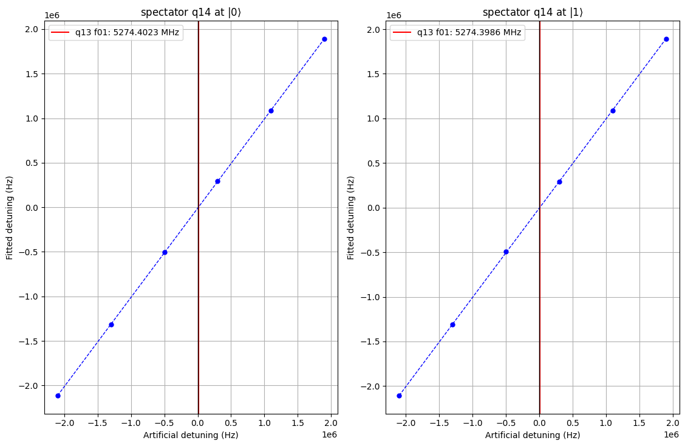

zz_coupling node

This node examines the static zz coupling betweeen two coupled qubits, q1 and q2 coupled via the coupler q1_q2, which is biased at some DC current.

We label q1 as "active" qubit and q2 as "spectator" qubit.
The measurement consits of performing a Ramsesy fringes measurement on the active qubit twice:

- when the spectator qubit is at $|0\rangle$ extracting the frequency $f_{01|spectator\ at\ 0}$.

- when the spectator qubit is at $|1\rangle$ extracting the frequency $f_{01|spectator\ at\ 1}$.

the ZZ coupling is calculated as $\zeta = f_{01|spectator\ at\ 0} - f_{01|spectator\ at\ 1}$.
<figure markdown>
{ title="comparison of the observed Ramsesy fringes on the Active qubit" alt="static ZZ coupling" }
<figcaption>Static ZZ coupling</figcaption>
</figure>

